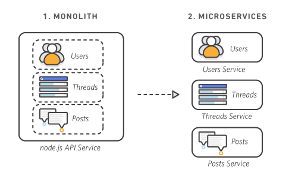

# Docker And k8s

- 목차

# 왜 쿠버네티스인가

[마이크로서비스란 무엇입니까? | AWS](https://aws.amazon.com/ko/microservices/)

## 모놀리식(Monolithic architecture) 아키텍처

전통적인 아키텍처, 기존에 사용하던 서비스 방법

서비스가 하나의 애플리케이션으로 돌아가는 구조

다양한 기능을 동작하는 서비스를 서버에서 실행하여 서비스 하는 것을 말합니다.

모놀리식 애플리케이션을 마이크로 서비스로 분할

## 모놀리식 아키텍처의 단점

### 모놀리식 서비스 아키텍처를 스케일링

기존의 애플리케이션을 그대로 복제하여 로드밸런싱

불필요한 서비스까지 모두 복제하게 되어 리소스가 낭비됩니다.

### 종속적인 라이브러리의 충돌

각각의 기능들은 서로 다른 기능을 제공하여 버전의 종속성이 필요한 경우가 존재합니다. 각 기능에 따른 라이브러리를 매 업데이트마다 관리하기 매우 힘듭니다.

### 조금만 수정해도 전체 빌드 및 배포 필요

소스코드 전체가 하나로써 동작하기때문에 작은 수정만 있더라도 전체를 빌드하여 다시 배포해야 합니다.

# 마이크로서비스 아키텍처

모놀리식 아키텍처의 대안으로 나왔습니다.

애플리케이션의 각각의 기능을 분리하여 개발 및 관리를 하게 되었습니다.

## 마이크로 서비스의 장점

서비스 단위 빠른 개발 : 개발자가 특정 비즈니스 로직에 대해서만 집중하여 개발 가능

배포 용이 : 개별 서비스 단위로 개발, 패키징, 빌드, 테스트, 배포로 각 서비스마다 유연한 스케줄

서비스 단위 고효율 저비용 Scale-Out 구조 : 서비스 단위로 스케일링이 가능하여 불필요한 서비스는 줄이고 더 많은 지원이 필요한 서비스는 확장 가능

## 마이크로 서비스의 단점

분산 시스템 환경에서 Transaction 보장, 테스트, 배포, 관리 복잡 ⇒ Docker와 k8s의 역할

# 컨테이너

컨테이너는 가상머신을 사용해 각 마이크로 서비스를 격리(isolate)하는 기술입니다.

## 컨테이너를 격리하는 기술

리눅스 커널에 구현된 기술을 사용합니다.

- 리눅스 네임 스페이스
- cgroup

### 리눅스 네임 스페이스

각 프로세스가 파일 시스템 마운트, 네트워크, 유저(uid), 호스트 네임(uts) 등에 대해 시스템에 독립 뷰를 제공

### 리눅스 컨트롤 그룹

프로세스로 소비할 수 있는 리소스양(CPU, 메모리, I/O, 네트워크 대역대, device 노드 등)을 제한합니다.

# Docker

- 컨테이너 기술을 지원하는 다양한 프로젝트 중에 하나
- 컨테이너 기술의 사실상 표준
- 다양한 운영체제에서 사용가능(windows에서는 사실 하이퍼 바이저 위에서 돌아갑니다.)

[Docker(container)의 작동 원리: namespaces and cgroups](https://tech.ssut.me/what-even-is-a-container/)

# Docker 아키텍쳐

Docker engin : 이미지, 네트워크, 디스크 등의 관리역할

Containerd: OCI 구현체(runC)를 이용해 container를 관리해주는 deamon

두 프로그램이 각각 돌아가기 때문에 Docker Engine을 재시작해도 각 이미지에 영향이 없습니다.

# Docker의 한계

서비스가 커지면 커질 수록 관리해야 하는 컨테이너의 양이 급격히 증가

도커를 사용하여 관리를 한다 하더라도 쉽지 않은 형태

# 쿠버네티스

다수의 컨테이너를 자동으로 운영하기 위한 오케스트레이션 도구 입니다. 많은 시스템을 통합, 컨테이너를 다루기 위한 API를 제공해 줍니다.

# DevOps 모델

- 소프트웨어 개발과 IT운영을 결합한 합성어
- 개발팀과 운영ㄴ팀의 협업으로 전체 라이프사이클을 함께 관리할 수 있자는 철학 또는 운동
- 더 빠르고 안정적으로 소프트웨어를 빌드, 릴리즈할 수 있도록 두 팀 간의 프로세스를 자동화 하는 일련의 과정

## DevOps의 이점

속도 : 서로의 업무에 대해 더 잘 이해하여 좀더 신속하게 사용자에게 필요한 업데이트를 수행 가능. 개발자는 소비자가 무엇을 원하는지, 운영자는 애플리케이션을 제공하는데 해결할 문제를 인지할 수 있습니다.

신속한 제공: 컨테이너와 마이크로서비스를 사용하면 더 자주 빠르게 릴리즈하는 것이 가능. 더 빠르게 좋은 기능을 제공할 수 있으며 개발자가 운영에 필요한 인프라와 하드웨어에 대해 잘 몰라도 릴리즈가 가능

개발과 릴리즈가 편해지므로 안정성이 확보, 협업 강화

# 노옵스(noops)

- 하느웨어 인프라를 이해하지 않아도 개발자가 직접 애릎리케이션을 배포 가능
- 물론 하드웨어 인프라를 관리할 사람이 필요
- 그러나 실행 중인 애플리케이션의 특성을 꼭 알 필요는 없음

### 개발자

애플리케이션을 배포하고 실행하는 단일 플랫폼으로써 실제 하드웨어를 추상화하고 노출하므로 개발자는 시스템 관리자의 도움 없이도 애플리케이션을 구성하고 배포할 수 있습니다.

### 시스템 관리자

실제로 하드웨어에서 실행되고 있는 애플리케이션에 대해 모르더라도 기본 인프라를 유지하고 가동하는데 집중할 수 있습니다.